
# HydraMesh


**Version 5.0.1 | Oct 10, 2025**  
**Developed by DeMoD LLC**  
**Contact:** alh477@demod.ltd 

**License:** [](https://www.gnu.org/licenses/lgpl-3.0)  


## Overview
HydraMesh is a free and open-source software (FOSS) framework evolved from the DeMoD Secure Protocol, designed for low-latency, modular, and interoperable data exchange. It supports applications like IoT messaging, real-time gaming synchronization, distributed computing, and edge networking. HydraMesh features a handshakeless design, efficient Protocol Buffers serialization, and a compatibility layer for UDP, TCP, WebSocket, and gRPC transports, enabling seamless peer-to-peer (P2P) networking with self-healing redundancy.

HydraMesh is hardware and language agnostic, supporting embedded devices (e.g., Raspberry Pi), cloud servers, and mobile platforms (Android/iOS) with bindings in Perl, Python, C, C++, JavaScript (Node.js), Go, Rust, Java/Kotlin, Swift, and Lisp. Version 5.0.0 introduces a plugin system for custom modules and transports, an AUTO mode for dynamic role assignment managed by a master node, and enhanced extensibility. Licensed under GPL-3.0, HydraMesh ensures open-source derivatives. It includes CLI, TUI, server/client logic, P2P, and AUTO modes, making it versatile for standalone tools, libraries, or networked services. SDKs (e.g., C SDK, HydraMesh-Lisp SDK) are developed as submodules for streamlined integration.

The bash scripts are there to help you set up your environment. There are Nix and Docker presets. You're welcome.

### HYDRA Acronym
The name **HydraMesh** reflects its core strengths: a self-healing, decentralized mesh with proxy-like adaptability. The acronym **HYDRA** stands for:

| Letter | Meaning | Feature | Description |
|--------|---------|---------|-------------|
| **H** | **Highly** | Performance | Sub-millisecond latency with <1% overhead, ideal for gaming and real-time apps. |
| **Y** | **Yielding** | Adaptive Routing | AI-driven topology optimization using Dijkstra and RTT-based grouping. |
| **D** | **Decentralized** | P2P Mesh | No single point of failure, with AUTO mode for dynamic role switching. |
| **R** | **Resilient** | Self-Healing | Automatic failover and redundancy, recovering peers in <50ms. |
| **A** | **Adaptive** | Proxy Middleware | Plugin system and transport switching (e.g., gRPC, LoRaWAN) for flexible data relay. |

> **Important**: HydraMesh complies with U.S. export regulations (EAR and ITAR). It avoids encryption to remain export-control-free. Users must ensure custom extensions comply; consult legal experts for specific use cases. DeMoD LLC disclaims liability for non-compliant modifications.

## Features
- **Modularity**: Independent components with standardized APIs; plugin system for custom extensions.
- **Interoperability**: Protocol Buffers and gRPC ensure cross-language (Perl, Python, C, C++, JS, Go, Rust, Java, Swift, Lisp) and cross-platform compatibility.
- **Low Latency**: Sub-millisecond exchanges with <1% overhead; handshakeless design for real-time applications.
- **Flexibility**: Compatibility layer for UDP, TCP, WebSocket, gRPC, and custom transports via plugins; supports mobile bindings.
- **Dynamic Role Assignment**: AUTO mode allows nodes to switch between client, server, or P2P roles under master node control, enabling AI-driven network optimization.
- **Usability**: CLI for automation, TUI for monitoring; server, client, P2P, and AUTO modes with logging; master node commands for role and config management.
- **Self-Healing P2P**: Redundant paths, failure detection, RTT-based grouping (clusters by <50ms threshold), and optimized routing (Dijkstra with RTT weights).
- **Persistence**: Integrated StreamDB for state, metrics, and message logging in HydraMesh-Lisp SDK, with potential extensions to other SDKs.
- **Open Source**: GPL-3.0 ensures transparency and community contributions.

## Architecture

```mermaid
graph TD
    A[HydraMesh Framework] --> B[CLI]
    A --> C[TUI]
    A --> D[Networking Layer]
    
    D --> E[Server Mode]
    D --> F[Client Mode]
    D --> G[P2P Mode]
    D --> H[AUTO Mode]
    H --> I[Master Node]
    I --> J[Role Assignment]
    I --> K[Config Management]
    I --> L[Metrics Collection]
    G --> M[Self-Healing Redundancy]
    M --> N[Peer Discovery]
    M --> O[Failure Detection]
    M --> P[RTT-Based Grouping]
    
    D --> Q[Transport Layer]
    Q --> R[WebSocket]
    Q --> S[UDP]
    Q --> T[TCP]
    Q --> U[gRPC]
    Q --> V[Custom Plugins]
    
    D --> W[Protocol Buffers]
    W --> X[Serialization/Deserialization]
    
    A --> Y[Language Bindings]
    Y --> Z[Perl]
    Y --> AA[Python]
    Y --> AB[C/C++]
    Y --> AC[Node.js]
    Y --> AD[Go]
    Y --> AE[Rust]
    Y --> AF[Java/Kotlin]
    Y --> AG[Swift]
    Y --> AH[Lisp]
    
    A --> AI[Platform Support]
    AI --> AJ[Embedded Devices]
    AI --> AK[Cloud Servers]
    AI --> AL[Mobile: Android/iOS]
    
    A --> AM[SDKs]
    AM --> AN[C SDK]
    AM --> AO[HydraMesh-Lisp SDK]
    AM --> AP[Future SDKs: Python, Perl, etc.]
    
    A --> AQ[Persistence Layer]
    AQ --> AR[StreamDB] 
```


## Installation
Clone the repository with submodules:
```bash
git clone --recurse-submodules https://github.com/ALH477/DeMoD-Communication-Framework.git
cd DeMoD-Communication-Framework
```

### Prerequisites
- **Perl**: CPAN modules: `JSON`, `IO::Socket::INET`, `Getopt::Long`, `Curses::UI`, `Google::ProtocolBuffers::Dynamic`, `Grpc::XS`, `Module::Pluggable`.
- **Python**: `pip install protobuf grpcio grpcio-tools importlib`.
- **C SDK**: `libprotobuf-c`, `libuuid`, `libdl`, `libcjson`, `cmake`, `ncurses`.
- **C++**: `grpc`, `protobuf`.
- **Node.js**: `grpc`, `protobufjs`.
- **Go**: `go get google.golang.org/grpc`, `go get google.golang.org/protobuf`.
- **Rust**: `tonic`, `prost` (for gRPC/Protobuf).
- **Java/Kotlin (Android)**: `io.grpc:grpc-okhttp`, `com.google.protobuf:protobuf-java`.
- **Swift (iOS)**: `GRPC-Swift`, `SwiftProtobuf`.
- **Lisp**: SBCL with Quicklisp; dependencies: `cl-protobufs`, `cl-grpc`, `cffi`, etc. (see `lisp/src/hydramesh.lisp`).
- **StreamDB**: Build `libstreamdb.so` from `streamdb/` using Cargo for persistence in HydraMesh-Lisp SDK.

### Generating Protobuf/gRPC
Use `protoc` to generate bindings for each language:
- **Perl/Python**: `protoc --perl_out=perl/lib --python_out=python/dcf --grpc_out=python/dcf --plugin=protoc-gen-grpc_python=python -m grpc_tools.protoc messages.proto services.proto`
- **C SDK**: `protoc --c_out=c_sdk/src messages.proto`
- **C++**: `protoc --cpp_out=cpp/src --grpc_out=cpp/src --plugin=protoc-gen-grpc=grpc_cpp_plugin messages.proto services.proto`
- **Node.js**: `protoc --js_out=import_style=commonjs:nodejs/src --grpc_out=nodejs/src --plugin=protoc-gen-grpc=grpc_node_plugin messages.proto services.proto`
- **Go**: `protoc --go_out=go/src --go-grpc_out=go/src messages.proto services.proto`
- **Rust**: Use `tonic-build` in `build.rs`
- **Android**: `protoc --java_out=android/app/src/main --grpc_out=android/app/src/main --plugin=protoc-gen-grpc-java=grpc-java-plugin messages.proto services.proto`
- **iOS**: `protoc --swift_out=ios/Sources --grpc-swift_out=ios/Sources messages.proto services.proto`
- **Lisp**: `protoc --lisp_out=lisp/src messages.proto services.proto`

### Building SDKs
- **C SDK**: `cd c_sdk && mkdir build && cd build && cmake .. && make`
- **Perl**: `cpanm --installdeps .`
- **Python**: `pip install -r python/requirements.txt`
- **Lisp**: Load via SBCL: `(load "lisp/src/hydramesh.lisp")`
- **Others**: Follow language-specific build tools (e.g., `cargo build` for Rust).


## Examples

### Perl (gRPC Client)
```perl
# perl/hydramesh.pl
use Grpc::XS;
use HydraMesh::Messages qw(HydraMeshMessage);
my $client = Grpc::XS::channel('localhost:50051');
my $stub = $client->service('HydraMeshService');
my $request = HydraMeshMessage->new(data => 'Hello');
my $response = $stub->SendMessage($request);
print $response->{data}, "\n";
```

### Python (gRPC Client)
```python
# python/hydramesh.py
import grpc
from hydramesh.services_pb2_grpc import HydraMeshServiceStub
from hydramesh.messages_pb2 import HydraMeshMessage
channel = grpc.insecure_channel('localhost:50051')
stub = HydraMeshServiceStub(channel)
request = HydraMeshMessage(data='Hello')
response = stub.SendMessage(request)
print(response.data)
```

### C SDK (Client)
```c
// c_sdk/examples/client.c
#include <hydramesh_sdk/hydramesh_client.h>
int main() {
    HydraMeshClient* client = hydramesh_client_init("config.json");
    hydramesh_client_start(client);
    hydramesh_client_send(client, "Hello", "peer1");
    hydramesh_client_stop(client);
    return 0;
}
```

### C++ (gRPC Server)
```cpp
// cpp/src/hydramesh.cpp
#include <grpcpp/grpcpp.h>
#include "services.grpc.pb.h"
class ServerImpl final : public HydraMeshService::Service {
    grpc::Status SendMessage(grpc::ServerContext* context, const HydraMeshMessage* request, HydraMeshMessage* response) override {
        response->set_data("Echo: " + request->data());
        return grpc::Status::OK;
    }
};
int main() {
    grpc::ServerBuilder builder;
    builder.AddListeningPort("0.0.0.0:50051", grpc::InsecureServerCredentials());
    ServerImpl service;
    builder.RegisterService(&service);
    std::unique_ptr<grpc::Server> server(builder.BuildAndStart());
    server->Wait();
    return 0;
}
```

### Node.js (gRPC Client)
```javascript
// nodejs/src/hydramesh.js
const grpc = require('@grpc/grpc-js');
const protoLoader = require('@grpc/proto-loader');
const packageDefinition = protoLoader.loadSync(['messages.proto', 'services.proto']);
const hydrameshProto = grpc.loadPackageDefinition(packageDefinition).hydramesh;
const client = new hydrameshProto.HydraMeshService('localhost:50051', grpc.credentials.createInsecure());
const request = { data: 'Hello', recipient: 'peer1' };
client.sendMessage(request, (err, response) => {
  if (err) console.error(err);
  console.log(response.data);
});
```

### Go (gRPC Server)
```go
// go/src/hydramesh.go
package main
import (
    "net"
    "google.golang.org/grpc"
    pb "hydramesh"  // Generated package
)
type server struct { pb.UnimplementedHydraMeshServiceServer }
func (s *server) SendMessage(ctx context.Context, in *pb.HydraMeshMessage) (*pb.HydraMeshMessage, error) {
    return &pb.HydraMeshMessage{Data: "Echo: " + in.Data}, nil
}
func main() {
    lis, _ := net.Listen("tcp", ":50051")
    s := grpc.NewServer()
    pb.RegisterHydraMeshServiceServer(s, &server{})
    s.Serve(lis)
}
```

### Rust (gRPC Server)
```rust
// rust/src/main.rs
use tonic::{transport::Server, Request, Response, Status};
use services::hydramesh_service_server::{HydraMeshService, HydraMeshServiceServer};
use services::{HydraMeshMessage};
#[derive(Default)]
pub struct Networking {}
#[tonic::async_trait]
impl HydraMeshService for Networking {
    async fn send_message(&self, request: Request<HydraMeshMessage>) -> Result<Response<HydraMeshMessage>, Status> {
        let reply = HydraMeshMessage { data: format!("Echo: {}", request.into_inner().data) };
        Ok(Response::new(reply))
    }
}
#[tokio::main]
async fn main() -> Result<(), Box<dyn std::error::Error>> {
    let addr = "[::1]:50051".parse()?;
    let net = Networking::default();
    Server::builder().add_service(HydraMeshServiceServer::new(net)).serve(addr).await?;
    Ok(())
}
```

### Lisp (gRPC Client with StreamDB)
```lisp
;; lisp/src/hydramesh.lisp (excerpt)
(in-package :hydramesh)
(hydramesh-init "config.json" :restore-state t)
(hydramesh-start)
(hydramesh-quick-send "Hello from Lisp!" "localhost:50052")
(hydramesh-db-insert "/test/key" "test data")  ; Store in StreamDB
(print (hydramesh-db-query "/test/key"))  ; Query from StreamDB
(hydramesh-stop)
```

### Android (Kotlin Client)
```kotlin
// android/app/src/main/kotlin/com/example/hydramesh/HydraMeshClient.kt
import io.grpc.ManagedChannelBuilder
import com.example.hydramesh.services.HydraMeshServiceGrpc
import com.example.hydramesh.messages.HydraMeshMessage
class HydraMeshClient(host: String, port: Int) {
    private val channel = ManagedChannelBuilder.forAddress(host, port).usePlaintext().build()
    private val stub = HydraMeshServiceGrpc.newBlockingStub(channel)
    fun sendMessage(data: String, recipient: String): String {
        val request = HydraMeshMessage.newBuilder().setData(data).setRecipient(recipient).build()
        return stub.sendMessage(request).data
    }
}
```

### iOS (Swift Client)
```swift
// ios/HydraMeshClient.swift
import GRPC
import NIO
import SwiftProtobuf
class HydraMeshClient {
    private let connection: ClientConnection
    private let client: HydraMeshServiceClient
    init(host: String, port: Int) {
        let group = PlatformSupport.makeEventLoopGroup(loopCount: 1)
        connection = ClientConnection.insecure(group: group).connect(host: host, port: port)
        client = HydraMeshServiceClient(channel: connection)
    }
    func sendMessage(data: String, recipient: String) -> String? {
        var request = HydraMeshMessage()
        request.data = data
        request.recipient = recipient
        do {
            let response = try client.sendMessage(request).response.wait()
            return response.data
        } catch { return nil }
    }
}
```

### Plugin Example (C Transport for C SDK)
```c
// c_sdk/plugins/custom_transport.c
#include <hydramesh_sdk/hydramesh_plugin_manager.h>
typedef struct { /* Private data */ } CustomTransport;
bool setup(void* self, const char* host, int port) { return true; }
bool send(void* self, const uint8_t* data, size_t size, const char* target) { return true; }
uint8_t* receive(void* self, size_t* size) { *size = 0; return NULL; }
void destroy(void* self) { free(self); }
ITransport iface = {setup, send, receive, destroy};
void* create_plugin() { return calloc(1, sizeof(CustomTransport)); }
const char* get_plugin_version() { return "1.0"; }
```

## Configuration
Create `config.json` based on `config.json.example`. HydraMesh supports various optimization levels to balance performance, reliability, and resource usage:

- **High Optimization (Performance-Focused)**: Prioritizes speed with minimal overhead—uses lightweight transports (e.g., UDP), quick mode in StreamDB (skipping CRC checks for ~10x faster reads), and reduced logging. Suitable for high-throughput, low-latency applications like gaming, where data integrity is managed externally.
  ```json
  {
    "framework": "hydramesh",
    "transport": "udp",
    "host": "localhost",
    "port": 50051,
    "mode": "p2p",
    "node-id": "node-1",
    "peers": ["localhost:50052"],
    "group-rtt-threshold": 20,
    "storage": "streamdb",
    "streamdb-path": "dcf.streamdb",
    "log-level": 2
  }
  ```

- **Balanced Optimization (Default)**: Combines reliability and performance—uses gRPC for reliable delivery, standard StreamDB mode (with CRC checks), and info-level logging. Ideal for general-purpose applications like distributed computing.
  ```json
  {
    "framework": "hydramesh",
    "transport": "gRPC",
    "host": "localhost",
    "port": 50051,
    "mode": "auto",
    "node-id": "node-1",
    "peers": ["localhost:50052"],
    "group-rtt-threshold": 50,
    "storage": "streamdb",
    "streamdb-path": "dcf.streamdb",
    "log-level": 1
  }
  ```

- **Low Optimization (Reliability-Focused)**: Emphasizes data integrity and debugging—uses reliable transports (e.g., SCTP), disables quick mode in StreamDB for full CRC checks, and enables debug logging. Best for development or critical systems like IoT with intermittent connectivity.
  ```json
  {
    "framework": "hydramesh",
    "transport": "sctp",
    "host": "localhost",
    "port": 50051,
    "mode": "master",
    "node-id": "node-1",
    "peers": ["localhost:50052"],
    "group-rtt-threshold": 100,
    "storage": "streamdb",
    "streamdb-path": "dcf.streamdb",
    "log-level": 0
  }
  ```

For master node:
```json
{
  "framework": "hydramesh",
  "transport": "gRPC",
  "host": "localhost",
  "port": 50051,
  "mode": "master",
  "node-id": "master1",
  "peers": ["localhost:50052", "localhost:50053"],
  "group-rtt-threshold": 50,
  "storage": "streamdb",
  "streamdb-path": "dcf.streamdb"
}
```

## Testing
Run tests with:
- C SDK: `cd c_sdk/build && make test_redundancy test_plugin && valgrind --leak-check=full ./p2p`
- Perl: `prove -r tests/`
- Python: `pytest tests/`
- Lisp: `sbcl --eval '(hydramesh:run-tests)'`
- Others: To be implemented (e.g., `cargo test` for Rust).
- Integration: Use Docker for multi-language setups; test RTT grouping, failover, AUTO mode role assignment, and StreamDB persistence.

### Enhanced Benefits of StreamDB Integration in HydraMesh-Lisp

As we continue building out the SDKs in the HydraMesh mono repository (https://github.com/ALH477/DeMoD-Communication-Framework), the integration of StreamDB into the HydraMesh-Lisp SDK represents a key advancement in providing persistent, high-performance storage. StreamDB, a lightweight, embedded key-value database implemented in Rust, is currently exclusive to the HydraMesh-Lisp SDK, serving as a proof-of-concept for how HydraMesh can incorporate advanced storage solutions. This exclusivity allows us to iterate rapidly in Lisp's expressive environment before expanding to other SDKs (e.g., C, Python), ensuring a battle-tested implementation across the repo. Below, we iterate on StreamDB's benefits, expanding on prior discussions with new insights into its synergy with HydraMesh-Lisp's DSL features, while emphasizing DeMoD LLC's role in developing the only complete GPLv3 version to democratize bleeding-edge technology.

#### 1. **Superior Persistence for Fault-Tolerant Distributed Systems**
   - **Iteration**: Beyond basic state recovery, StreamDB's paged storage (4KB pages with chaining for up to 256MB documents) and reverse trie indexing enable efficient, prefix-based queries for hierarchical data (e.g., `/state/peers/node1/rtt`). In HydraMesh-Lisp, this means nodes can persist complex structures like peer groups or message logs atomically, reducing fragmentation and supporting up to 8TB databases—ideal for scaling HydraMesh networks.
   - **HydraMesh-Lisp Specific**: The DSL's macros (e.g., `def-hydramesh-plugin`) allow seamless wrapping of StreamDB operations, making persistence feel native (e.g., `hydramesh-db-insert "/metrics/sends" count`). This compactness (integrated in ~50 lines) enhances fault tolerance in AUTO mode, where dynamic role switches rely on quick state reloads from StreamDB.
   - **Democratization Angle**: DeMoD's GPLv3-complete version ensures open access to advanced features like automatic chain repair, empowering developers to build resilient systems without proprietary dependencies.

#### 2. **Ultra-Low-Latency Data Access for Real-Time Workloads**
   - **Iteration**: StreamDB's QuickAndDirtyMode (skipping CRC for ~10x faster reads, up to 100MB/s) and LRU caching complement HydraMesh-Lisp's sub-millisecond messaging, enabling near-instant access to cached states. New: In edge scenarios, StreamDB's no-mmap fallback ensures consistent performance on constrained hardware, with <1ms lookups for RTT metrics during peer grouping.
   - **HydraMesh-Lisp Specific**: Integrated directly into `hydramesh-node` (via `streamdb` slot), it caches results from `hydramesh-get-metrics` or `hydramesh-group-peers`, reducing I/O in high-frequency loops. Lisp's dynamic typing pairs with StreamDB's binary stream support for flexible data handling (e.g., storing serialized CLOS messages).
   - **Democratization Angle**: By open-sourcing the full GPLv3 implementation, DeMoD makes high-speed, embedded databases accessible, leveling the playing field for indie developers against proprietary solutions like Redis.

#### 3. **Modular Extensibility and Plugin Synergy**
   - **Iteration**: StreamDB's `DatabaseBackend` trait allows custom backends (e.g., in-memory for testing), extending HydraMesh-Lisp's plugin system. New: Middleware can hook into StreamDB operations (e.g., serialize data as JSON/CBOR before insert), creating a unified extension point for transports and storage.
   - **HydraMesh-Lisp Specific**: As a core backend (not a plugin, for tight coupling), it enhances modularity—e.g., `save-state` uses StreamDB paths like `/state/config`, queryable via `hydramesh-db-search "/state/"`. This integrates with transports (e.g., Serial for embedded), storing IoT data locally before syncing.
   - **Democratization Angle**: DeMoD's GPLv3 version includes pluggable backends, encouraging community extensions (e.g., S3 integration), fostering innovation in HydraMesh's ecosystem.

#### 4. **Optimized for Resource-Constrained Deployments**
   - **Iteration**: StreamDB's tunable parameters (e.g., page size, cache limits) and minimal dependencies make it perfect for HydraMesh-Lisp on devices like Raspberry Pi. New: Free page management (first-fit LIFO with consolidation) minimizes fragmentation, supporting long-running edge nodes with limited storage.
   - **HydraMesh-Lisp Specific**: The DSL's ~700-line efficiency pairs with StreamDB's lightweight footprint, enabling deployments on ARM-based IoT hardware. For example, persist sensor logs in StreamDB during offline periods, syncing via LoRaWAN when connected.
   - **Democratization Angle**: DeMoD's complete GPLv3 impl democratizes embedded databases, providing features like orphan collection without costly licenses, ideal for open hardware projects.

#### 5. **Seamless Cross-Language Interoperability**
   - **Iteration**: StreamDB's file-based storage and FFI (via `libstreamdb.so`) enable shared access across HydraMesh SDKs. New: HydraMesh-Lisp nodes can store JSON-serialized metrics in StreamDB, readable by C SDKs for hybrid networks.
   - **HydraMesh-Lisp Specific**: CFFI bindings in `hydramesh.lisp` expose StreamDB as DSL functions (e.g., `hydramesh-db-insert`), ensuring Lisp's dynamic features (e.g., macros) enhance interoperability without complexity.
   - **Democratization Angle**: As the only complete GPLv3 version (developed from Iain Ballard's incomplete C# repo), DeMoD's Rust impl promotes open access to advanced FFI-capable databases.

#### 6. **Robust Error Handling and Automated Recovery**
   - **Iteration**: StreamDB's CRC32 checks, version monotonicity, and recovery (e.g., index rebuild) bolster HydraMesh-Lisp's `hydramesh-error` handling. New: Integrates with failover (`hydramesh-heal`), recovering states from StreamDB after crashes.
   - **HydraMesh-Lisp Specific**: Errors from StreamDB are wrapped in `hydramesh-error`, logged via `log4cl`, and tested in FiveAM (e.g., `streamdb-integration-test`), ensuring resilience in P2P meshes.
   - **Democratization Angle**: GPLv3 ensures community-driven improvements to recovery, making reliable storage accessible for all.

#### 7. **Advanced Monitoring and Analytics**
   - **Iteration**: StreamDB stores historical metrics (e.g., `/metrics/sends`), enabling trend analysis. New: Prefix searches (`hydramesh-db-search "/metrics/"`) support AI optimization in Master mode.
   - **HydraMesh-Lisp Specific**: Enhances `hydramesh-get-metrics` by querying StreamDB, visualized in TUI or Graphviz.
   - **Democratization Angle**: DeMoD's open impl democratizes analytics-ready storage for edge AI.

#### 8. **Streamlined Testing and Validation**
   - **Iteration**: StreamDB's tests integrate with FiveAM, verifying persistence in network scenarios. New: Ensures data survives restarts, critical for AUTO mode.
   - **HydraMesh-Lisp Specific**: `streamdb-integration-test` validates CRUD and recovery, extending HydraMesh's testing.
   - **Democratization Angle**: GPLv3 fosters shared testing tools for reliable HydraMesh deployments.

### StreamDB's Exclusivity to HydraMesh-Lisp (For Now)
StreamDB is currently integrated only into the HydraMesh-Lisp SDK to prototype its benefits in Lisp's dynamic environment (e.g., macros for StreamDB wrappers). This allows rapid iteration on persistence features (e.g., message logging in `hydramesh-send`) before porting to other SDKs. Future plans include CFFI bindings for C SDK and Python wrappers, expanding StreamDB across the mono repo.

### DeMoD's GPLv3-Complete StreamDB: Democratizing Bleeding-Edge Tech
DeMoD LLC developed the only complete GPLv3 version of StreamDB from Iain Ballard's incomplete C# repo, reimplementing it in Rust for safety and performance. This ensures bleeding-edge features (e.g., trie indexing, MVCC-like versioning) are freely available, promoting open innovation in embedded storage and aligning with HydraMesh's FOSS ethos. By open-sourcing under GPLv3, DeMoD democratizes tech typically locked in proprietary systems, enabling developers to build advanced, cost-free solutions.

## Documentation

For comprehensive documentation on the HydraMesh Framework, including detailed SDK guides, API references, design specifications, and contribution processes, refer to the Sphinx-generated docs. These cover all SDKs in the mono repo (e.g., C SDK, Python, HydraMesh-Lisp, Rust) and are built from Markdown files like `README.markdown` and `dcf_design_spec.markdown`.

### Viewing the Documentation
- **Online**: Hosted on GitHub Pages at [https://alh477.github.io/DeMoD-Communication-Framework/](https://alh477.github.io/DeMoD-Communication-Framework/) (auto-built via CI/CD on pushes to `main`).
- **Locally**: Build the docs yourself:
  ```bash
  cd docs
  pip install -r requirements.txt  # Install Sphinx, myst-parser, etc.
  make docs-html  # Generates HTML in docs/_build/html/
  open _build/html/index.html  # View in browser
  make docs-pdf   # Generates PDF in docs/_build/latex/
  ```
- **Key Sections**:
  - [Design Specifications](https://alh477.github.io/DeMoD-Communication-Framework/specs/dcf_design_spec.html): Covers protocol design, AUTO mode, master node, plugins, and SDK guidelines.
  - [SDK Guides](https://alh477.github.io/DeMoD-Communication-Framework/guides/sdk-development.html): Tutorials for developing and integrating SDKs (e.g., C SDK with RTT grouping, HydraMesh-Lisp with StreamDB persistence).
  - [API References](https://alh477.github.io/DeMoD-Communication-Framework/api/index.html): Auto-generated from code comments/docstrings across languages (e.g., `hydramesh_client_send_message` in C, `hydramesh-quick-send` in Lisp).
  - [Contribution Guidelines](https://alh477.github.io/DeMoD-Communication-Framework/process/CONTRIBUTING.html): How to add new SDKs or plugins.

The docs support multi-format outputs (HTML, PDF, ePub) and include custom rendering for Protobuf schemas. For source, see the `docs/` directory in the repo. Contributions to improve docs are welcome—follow the style in `dcf_design_spec.markdown`.

## Contributing
Contributions are welcome! Follow these steps:
1. Fork the repo.
2. Create a feature branch (`git checkout -b feature/xyz`).
3. Add tests and code (follow style: `perltidy`, `black`, `ktlint`, `swiftformat`, `clang-format` for C, Lisp conventions for HydraMesh-Lisp).
4. Submit a PR with a clear description using the [PR template](docs/PR_TEMPLATE.md).
5. Discuss issues via [GitHub Issues](https://github.com/ALH477/DeMoD-Communication-Framework/issues).
New SDKs (e.g., Python, Perl) encouraged; ensure RTT grouping, plugins, AUTO mode, and GPL-3.0 compliance.

# [DeMoD LLC](https://DeMoD.ltd) Cut the bullshit, Cut the price. Innovation without the overhead.

[](https://ko-fi.com/F1F11PNYX4)

```
  ___   _      _   _   ___  ____________          ______    ___  ___     ______   _      _     _____ 
 / _ \ | |    | | | | /   ||___  /___  /          |  _  \   |  \/  |     |  _  \ | |    | |   /  __ \
/ /_\ \| |    | |_| |/ /| |   / /   / /   ______  | | | |___| .  . | ___ | | | | | |    | |   | /  \/
|  _  || |    |  _  / /_| |  / /   / /   |______| | | | / _ \ |\/| |/ _ \| | | | | |    | |   | |    
| | | || |____| | | \___  |./ /  ./ /             | |/ /  __/ |  | | (_) | |/ /  | |____| |___| \__/\
\_| |_/\_____/\_| |_/   |_/\_/   \_/              |___/ \___\_|  |_/\___/|___/   \_____/\_____/\____/
```

