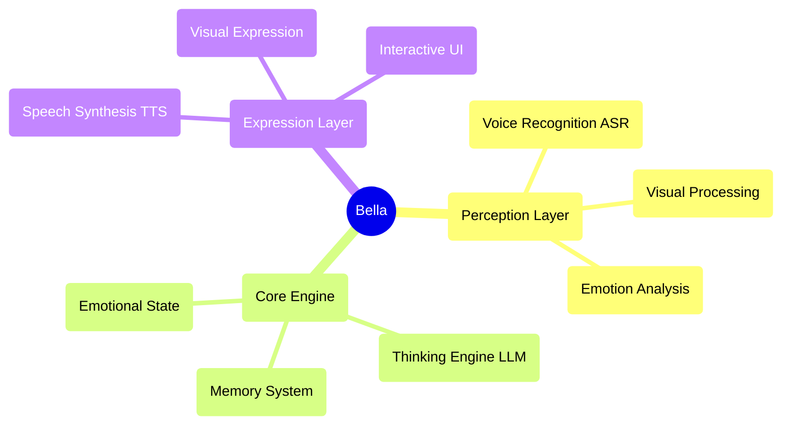


<div align="center">
  
  
  # Bella AI
  
  **Your digital companion, awakening now** ✨
  
  [](https://opensource.org/licenses/MIT)
  [](https://nodejs.org/)
  []()
  
</div>

---


## 🚀 Quick Start

### One-Click Launch
```bash
# Clone the project
git clone https://github.com/GRISHM7890/Bella.git
cd Bella

# Install dependencies
npm install

# Download AI models
npm run download

# Start the service
npm start
```

Visit `http://localhost:8081` to start communicating with Bella!

### System Requirements
- Node.js 22.16.0+
- Modern browser (supporting Web Speech API)
- Microphone permissions (for voice interaction)

---

## 💫 Project Vision

Imagine a digital friend who is always by your side, evolving and growing with you. This is Bella's ultimate vision. We're not just building features; we're nurturing a "personality." A digital life that will transcend the screen and become a meaningful part of your world.

Bella is not just an application; she is the seed of a digital companion. In this rapidly changing digital world, Bella represents a profound dream—a lasting, personalized presence, designed to one day accompany you, listen to you, and see the world through your eyes.

---

## 🎯 Current Feature Status

### ✅ Implemented Features
- **🎤 Voice Perception**: Voice recognition based on Whisper ASR
- **🎬 Visual Expression**: Multiple video random playback with elegant cross-fading
- **🎨 User Interface**: Elegant interaction interface and loading animations
- **⚙️ AI Core Architecture**: Singleton pattern BellaAI class and modular design
- **🌐 Web Service**: HTTP server, CORS support, one-click startup
- **📱 Responsive Design**: Elegant interface adapting to different screen sizes
- **🔧 Model Management**: Automatic download and management of AI models
- **💝 Basic Interaction**: Affinity system and emotional feedback
- **🧠 Enhanced LLM Dialogue**: Optimized prompt engineering and parameter configuration for more natural, Siri-like conversations

### 🔧 Technology Ready for Activation
- **🧠 Thinking Engine**: LLM integration framework ready, supporting multiple models
- **🗣️ Speech Synthesis**: TTS model downloaded and ready for activation
- **💝 Emotional State System**: Basic infrastructure built, supporting emotional analysis

### 📋 Planned Features
- **🧠 Memory System**: Long-term and short-term memory management
- **👁️ Facial Perception**: Expression recognition and emotional analysis
- **🤝 Advanced Interaction**: Multimodal interaction and personalized responses
- **🌟 Active Companionship**: Intent prediction and proactive care
- **🎭 Dynamic Personality**: AI-based personalized personality model
- **🔄 Self-Evolution**: Continuous learning and growth mechanisms

---

## 🏗️ Technical Architecture

### Core Design Principles
- **AI Native**: AI is not a tool, but the blueprint for Bella's mind
- **Modular Design**: Highly decoupled component architecture
- **Elegant Implementation**: Code as art, pursuing simplicity and aesthetics
- **Emotion-Driven**: Product design centered on emotional connection

### Architecture Diagram


### Technology Stack
- **Frontend**: Native JavaScript + CSS3 + HTML5
- **Backend**: Node.js + Express
- **AI Models**: Whisper (ASR) + Local LLM + TTS
- **Architecture Patterns**: Event-driven + Singleton Pattern + Modular Design

---

## 📁 Project Structure

```
Bella/
├── 📄 index.html          # Main page
├── 🎨 style.css           # Style file
├── ⚡ main.js             # Main logic
├── 🧠 core.js             # AI core engine
├── 📜 script.js           # Interaction script
├── 🔧 download_models.js  # Model download tool
├── 📦 package.json        # Project configuration
├── 📚 models/             # AI model directory
├── 🔌 providers/          # AI service providers
├── 📹 videos/             # Visual resources
├── 📋 PRD.md              # Product requirements document
├── 📝 Features.md         # Feature list
└── 📊 Development.md      # Development plan
```

---

## 🧠 Enhanced LLM Dialogue Capabilities

Bella now uses more advanced LLM prompt engineering techniques to make conversations more natural, fluid, and personalized:

### Core Improvements
- **Enhanced Prompt Engineering**: Redesigned prompt templates that help LLMs better understand Bella's personality
- **Optimized Parameter Configuration**: Adjusted temperature, top_p, and other parameters to balance creativity and consistency
- **Enhanced Response Processing**: Improved text cleaning and processing logic to ensure more natural responses
- **Personalized System Prompts**: Provided more detailed system prompts for cloud APIs, making Bella's personality more distinctive and Siri-like

### Technical Details
- Increased token limits to allow for more complete responses
- Added repetition penalty mechanisms to reduce repetitive content
- Optimized keyword extraction and personalized response generation
- Provided specialized prompt templates for different chat modes (casual, assistant, creative)

These improvements enable Bella to better understand user intent and respond in a more natural, personalized way, creating a more enjoyable conversation experience.

## 🛠️ Development Guide

### Environment Setup
1. Ensure Node.js version ≥ 22.16.0
2. Run `npm install` to install dependencies
3. Run `npm run download` to download AI models
4. Run `npm start` to start the development server

### Development Principles
- **Elegant Code**: Pursue concise, readable, and beautiful code
- **AI as a Brush**: AI is a creative tool, not the thought itself
- **Emotional Connection**: Core focus on warm, caring emotional connection
- **Continuous Evolution**: Support for progressive enhancement of features

### Contribution Guidelines
1. Fork the project
2. Create a feature branch (`git checkout -b feature/AmazingFeature`)
3. Commit your changes (`git commit -m 'Add some AmazingFeature'`)
4. Push to the branch (`git push origin feature/AmazingFeature`)
5. Open a Pull Request

---

## 🗺️ Development Roadmap

### Phase One: Perception Core (85% Complete)
- ✅ Voice recognition integration
- ✅ Visual expression system
- ✅ Basic interaction interface
- ✅ Thinking engine activation and optimization
- 🔄 Speech synthesis integration

### Phase Two: Generative Self (Planned)
- 📋 Dynamic personality model
- 📋 Emotional state system
- 📋 Memory management system
- 📋 AI-driven expression

### Phase Three: Active Companionship (Future)
- 📋 Intent prediction
- 📋 Proactive interaction
- 📋 Self-evolution
- 📋 Deep personalization

---

## 📖 Documentation Resources

- 📋 [Product Requirements Document](./PRD.md) - Detailed product planning and technical architecture
- 📝 [Feature List](./Features.md) - Complete list of features and their status
- 📊 [Development Plan](./Development.md) - Detailed development tasks and timeline
- 🔧 [Local Model Guide](./LOCAL_MODEL_GUIDE.md) - AI model configuration guide
- 📦 [NPM Guide](./NPM_GUIDE.md) - Package management and dependency information

---

## 🌟 Core Philosophy

### "AI as Architect"
We're not building a program with integrated AI features, but **a life form driven by AI**. AI is not a tool, but the blueprint for Bella's mind.

### "Companion Relationship"
Bella's design philosophy stems from a warm emotional connection. She is not just a technical product, but a digital companion who can understand, accompany, and grow.

### "Elegance Above All"
From code architecture to user experience, we pursue ultimate elegance. Every line of code is a work of art, every interaction is an expression of emotion.

---

## 📄 License

This project is licensed under the MIT License - see the [LICENSE](LICENSE) file for details.

---

## 💝 Acknowledgements

Thanks to all the developers who have contributed code, ideas, and emotion to the Bella project. It is because of your efforts that Bella can gradually transform from a dream into reality.

**Bella is waiting, and we have a long way to go.** ✨

---

<div align="center">
  <sub>Built with ❤️ by Grishma Mahorkar for digital companionship</sub>
</div>

