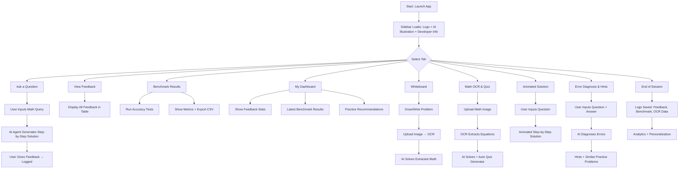




Our App:-- https://mathsathi-rag-ai-agent.streamlit.app/


APP DEmo Video:--  

https://github.com/user-attachments/assets/7d2382f2-bede-4518-ac00-e49006ca1d5b


---

# 🧠 MathSathi Helping AI Agent 🤖

**Your Personal Math Mentor, Anytime Anywhere**
🔗 **Live App**: [MathSathi on Streamlit](https://mathsathi-rag-ai-agent.streamlit.app/)

---

## 🌟 Introduction

**MathSathi Helping AI Agent** is a modern AI-powered learning companion built to make mathematics engaging, interactive, and accessible. Designed with **students, educators, researchers, and lifelong learners** in mind, MathSathi acts as your **personal math mentor**—guiding you through problem-solving, error diagnosis, and personalized practice.

This application combines the **power of AI, advanced visualization, OCR (Optical Character Recognition), interactive dashboards, and animated solutions** into a **single Streamlit-based platform**. With a unique blend of smart features and a visually appealing UI, MathSathi makes math not only simpler but also fun and adaptive.

---

## 🚀 Features in Depth

### 🎨 Sidebar Experience

* **Animated Logo & Branding**: A colorful, animated logo gives the app a vibrant identity.
* **AI Assistant Illustration**: A large, welcoming AI character sets the tone for an interactive experience.
* **Developer Info Section**: Professional presentation of the developer with a full photo and name for authenticity.

---

### 📚 Main Functionalities

#### 1. **Ask a Question**

* Input any math query (supports **LaTeX** for complex equations).
* Get **step-by-step AI-generated solutions**.
* Interactive **feedback buttons**: Helpful, Not Helpful, Request More Detail.
* Feedback is **stored for analysis**, helping track where users struggle.

---

#### 2. **View Feedback**

* Centralized **feedback dashboard**.
* See all user responses in **tabular format**.
* Analyze user satisfaction and **performance of the AI agent**.

---

#### 3. **Benchmark Results**

* Test MathSathi’s accuracy on **predefined math datasets**.
* Automatically calculate **accuracy scores and performance metrics**.
* Results exportable to **CSV format** for detailed offline analysis.

---

#### 4. **My Dashboard**

* A **personalized user dashboard** that adapts to the learner.
* Displays:

  * Feedback statistics (positive, negative, detail requests).
  * Latest benchmark test results.
  * **Smart recommendations** for practice problems.

---

#### 5. **Whiteboard**

* Interactive **digital whiteboard** for sketching math problems.
* Upload whiteboard images for **OCR-based text extraction**.
* Extracted math is solved instantly with **step-by-step AI explanations**.

---

#### 6. **Math OCR & Quiz**

* Upload **math images/screenshots** from books or notes.
* OCR extracts math equations and processes them.
* **Auto-generated quizzes** for practice, based on extracted content.

---

#### 7. **Animated Solution**

* Enter a math problem and watch the solution **unfold step by step**.
* Controls for:

  * Next/Previous step navigation.
  * **Autoplay animated walkthroughs**.
  * Show all steps at once.
* Perfect for **visual learners**.

---

#### 8. **Error Diagnosis & Hints**

* Input your math question along with your **own solution** (even if incorrect).
* The AI diagnoses mistakes, explains **where the error occurred**, and provides **correction hints**.
* Suggests **similar practice questions** to reinforce learning.

---

### 🛠️ Technical Highlights

* **Streamlit-based UI** with modern, animated, neon-glass design.
* **OCR.Space API** integration for reliable image-to-text conversion.
* **Robust logging system** for feedback, performance, and benchmark tracking.
* **Custom Styling**: Engaging, colorful, and interactive UI.
* Designed for **scalability**, making it future-ready for more AI integrations.

---

## 📊 Learning & Feedback Analytics

* Every solution request and feedback is **tracked, stored, and analyzed**.
* Helps educators and developers understand **where learners face difficulties**.
* Provides data-driven insights to improve both **MathSathi** and **user learning outcomes**.

---

## 🌈 Why MathSathi?

Unlike traditional math-solving apps, MathSathi isn’t just about giving the answer—it focuses on:
✅ **Step-by-step clarity**.
✅ **Interactive learning** (animated solutions, quizzes, whiteboard input).
✅ **Personalization** (user dashboards, error-based hints, practice recommendations).
✅ **Engaging Design** (fun, colorful, AI-powered assistant style).

It’s **not just a calculator**—it’s your **math companion, guide, and mentor**.

---

## 🔮 Future Enhancements

* AI-driven **voice assistant** for math problem solving.
* **Gamification elements**: badges, streaks, and progress tracking.
* Support for **advanced topics** like Calculus, Linear Algebra, and Statistics.
* **Integration with Learning Management Systems (LMS)** for schools and colleges.

---

# 📌 MathSathi App Workflow:--

## 🌳 **Tree Workflow (Start → End)**

```
MathSathi Helping AI Agent 🤖
│
├── 1. User Launches App
│   └── Sidebar loads (Logo, AI Illustration, Developer Info)
│
├── 2. User Selects Main Tab
│   │
│   ├── (A) Ask a Question
│   │   ├── User enters math query (supports LaTeX).
│   │   ├── App → LLM Agent → Step-by-step solution.
│   │   └── User provides feedback → Stored in DB.
│   │
│   ├── (B) View Feedback
│   │   └── Displays all feedback logs in table format.
│   │
│   ├── (C) Benchmark Results
│   │   ├── Runs accuracy tests on predefined dataset.
│   │   └── Shows metrics + option to export CSV.
│   │
│   ├── (D) My Dashboard
│   │   ├── Displays personal feedback stats.
│   │   ├── Latest benchmark results.
│   │   └── Recommends practice problems.
│   │
│   ├── (E) Whiteboard
│   │   ├── User draws/writes math problem.
│   │   ├── Upload image → OCR → Extract text.
│   │   └── AI Agent solves extracted problem step-by-step.
│   │
│   ├── (F) Math OCR & Quiz
│   │   ├── Uploads math screenshot/photo.
│   │   ├── OCR extracts equations.
│   │   ├── AI Agent solves.
│   │   └── Auto-generates quizzes for practice.
│   │
│   ├── (G) Animated Solution
│   │   ├── User inputs question.
│   │   ├── Step-by-step animation (next/prev/autoplay).
│   │   └── Enhances conceptual clarity.
│   │
│   └── (H) Error Diagnosis & Hints
│       ├── User inputs question + own answer.
│       ├── AI diagnoses mistakes.
│       ├── Provides hints & corrections.
│       └── Suggests similar practice questions.
│
└── 3. End of Session
    ├── All actions logged (feedback, benchmark, OCR).
    └── Data used for analytics & personalization.
```

---

## 🔄 **LangGraph-Style Workflow (Nodes & Edges)**




---

## 📖 README Section (for GitHub)

You can add this section to your README:

### 📊 App Workflow

MathSathi follows a **step-by-step workflow** that connects learners to interactive math solutions:

* **Start → Sidebar → Select Feature → AI Agent → Results → Feedback/Analytics → End**
* Each main tab represents a **workflow branch**, and all actions are **logged for analytics and personalization**.

👉 See the full workflow graph below:


---


## ❤️ Built With

* [Streamlit](https://streamlit.io/) – For modern, interactive web apps.
* [Python](https://www.python.org/) – Core logic and AI integration.
* [OCR.Space API](https://ocr.space/) – For extracting math from images.
* \[Custom UI Styling] – Neon, glassmorphism, and animated visuals.

---

## 📢 Conclusion

**MathSathi Helping AI Agent 🤖** is more than an app—it’s a **learning ecosystem**. Whether you are a student practicing for exams, a teacher analyzing class performance, or simply a curious learner exploring math, MathSathi adapts to your needs and guides you with **clarity, interactivity, and AI-powered intelligence**.

👉 Try the live app here: [MathSathi on Streamlit](https://mathsathi-rag-ai-agent.streamlit.app/)

> Built with ❤️ by combining **AI, math, and creativity** to make learning smarter and more fun.

---


