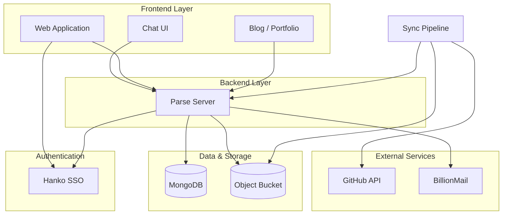
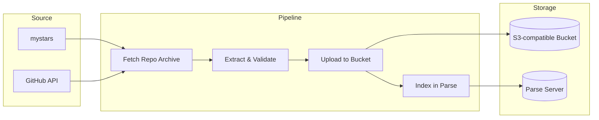
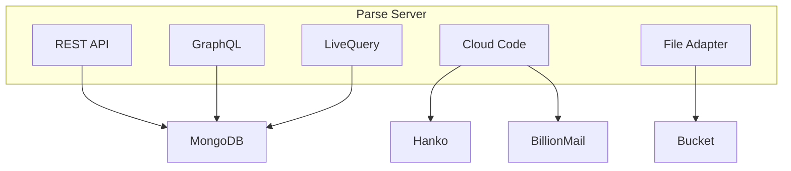
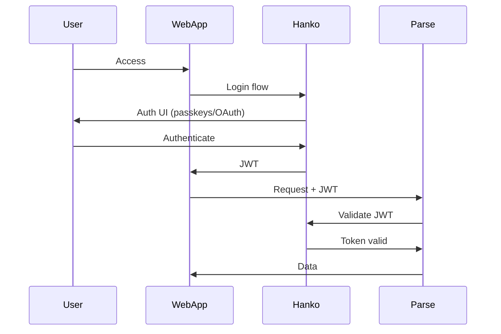
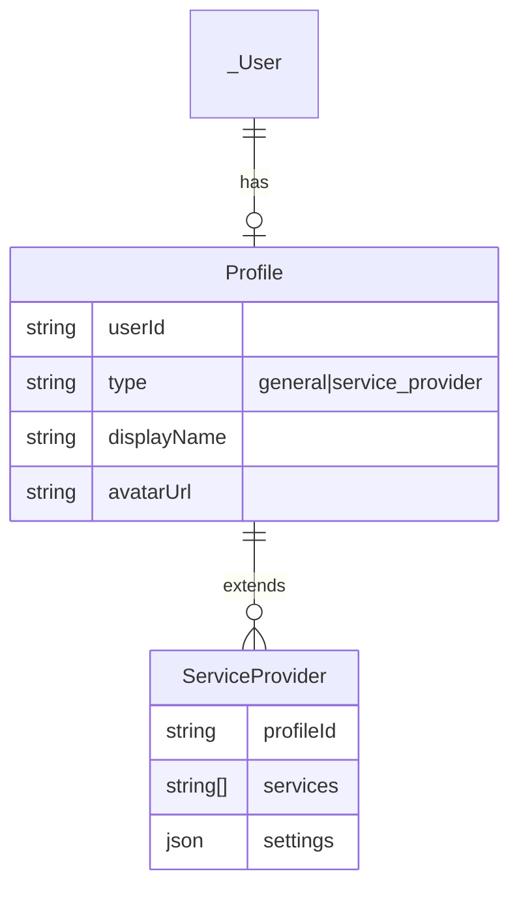
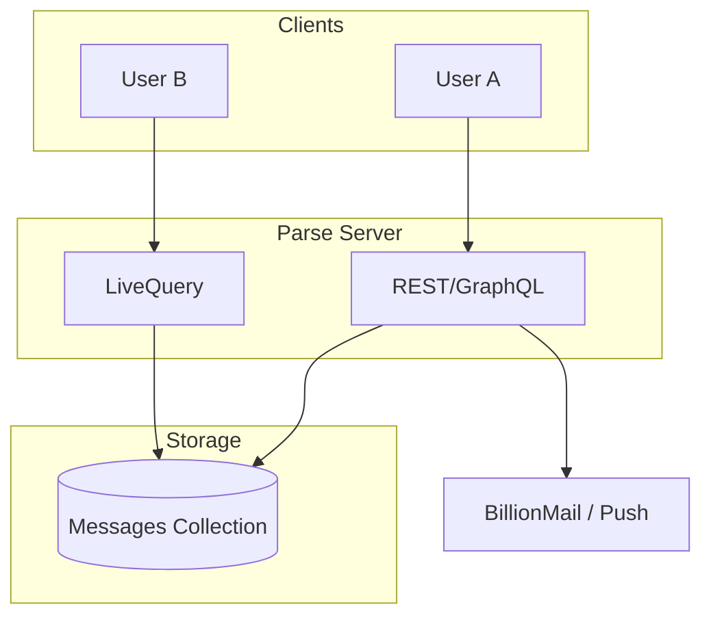
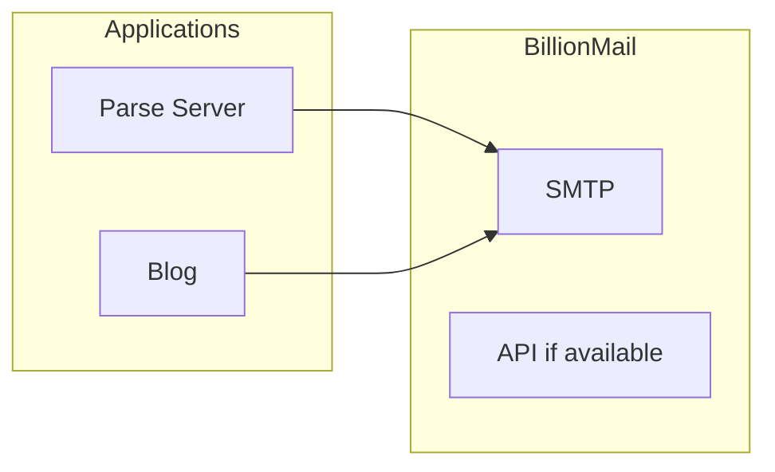
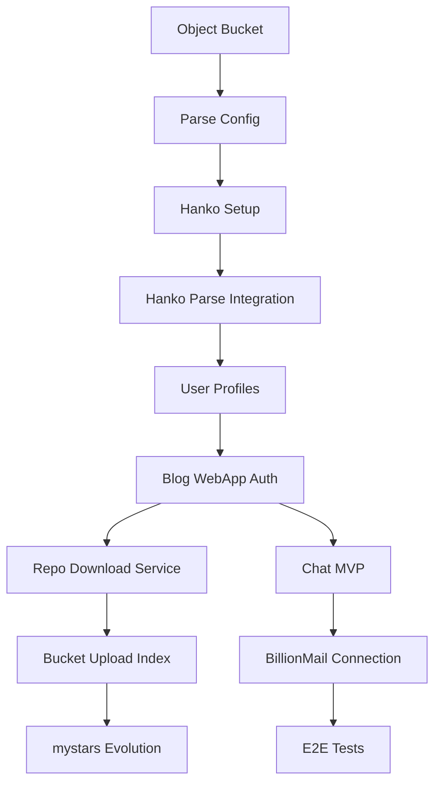
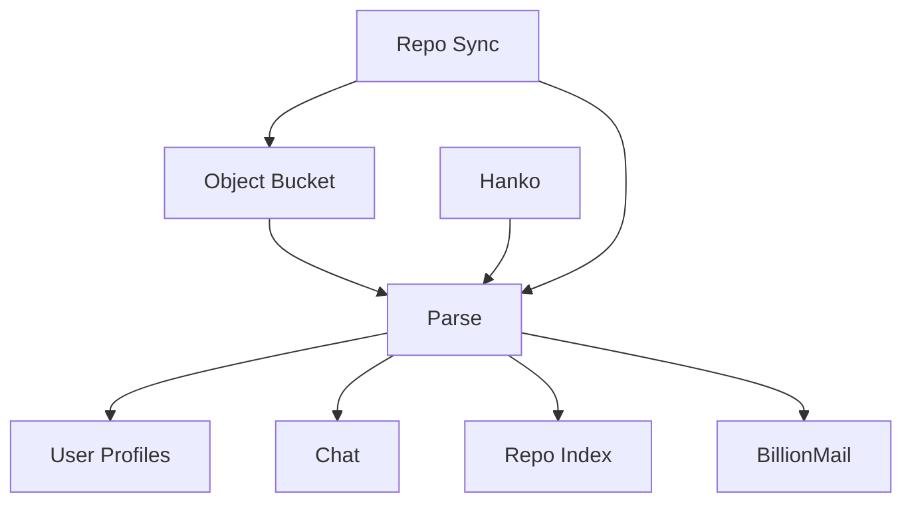

# NewSaaS Platform Expansion Plan

<script src="https://cdn.jsdelivr.net/npm/mermaid@10/dist/mermaid.min.js"></script>
<script>
  mermaid.initialize({ startOnLoad: true, theme: 'default', securityLevel: 'loose' });
</script>

A comprehensive plan to evolve the platform from a static portfolio/blog into a full-stack SaaS with GitHub archive storage, user management, chat, and email capabilities.

---

## Executive Summary

| Component | Purpose | Location |
|-----------|---------|----------|
| **Parse Server** | Main BaaS: data, files, real-time | `Backends/parse-server` |
| **Hanko** | SSO, passkeys, OAuth, MFA | `SSO/hanko` |
| **BillionMail** | Email delivery, campaigns | `Mail/BillionMail` |
| **Object Bucket** | GitHub repo archives (S3-compatible) | New |
| **mystars + Sync** | Download full repos → bucket | Evolve `mystars` |

---

## 1. High-Level Architecture



---

## 2. Component Overview

### 2.1 GitHub Repo Download → Object Bucket

**Current state:** `mystars` fetches only READMEs; `sync_portfolio.rb` reads them and generates `portfolio.json`.

**Target state:** Download full repositories as tarballs/zip, store in an object bucket, and register metadata in Parse Server.



**Key decisions:**
- **Bucket:** MinIO (self-hosted), AWS S3, or Cloudflare R2
- **Format:** Repo tarball (`archive/master.tar.gz`) or shallow clone zip
- **Sync:** Extend mystars workflow or create a separate service that runs on schedule

---

### 2.2 Parse Server Backend

**Location:** `Backends/parse-server`

**Role:**
- Main API for app data, users (linked to Hanko), and file references
- File storage adapter pointing to object bucket
- LiveQuery for real-time chat
- Cloud Code for business logic (sync triggers, notifications)



**Use cases:**
- User profiles (service provider vs general user)
- Chat messages
- GitHub repo metadata and bucket URLs
- Notifications, preferences

---

### 2.3 Hanko SSO

**Location:** `SSO/hanko`

**Role:**
- Single sign-on for WebApp, Blog, and future clients
- Passkeys, passwords, OAuth (Google, GitHub, etc.)
- SAML for enterprise (optional)
- JWT for Parse Server validation



**Integration with Parse:**
- Use Parse auth adapter or custom auth middleware to validate Hanko JWT
- Map Hanko user ID to Parse `_User` for ACLs and relations

---

### 2.4 User Profiles: Service Provider vs General User

| Profile Type | Capabilities |
|--------------|--------------|
| **General User** | View portfolio, use chat, subscribe to newsletters |
| **Service Provider** | All of above + list services, manage bookings, access analytics |



---

### 2.5 Chat Feature

**Implementation options:**
- **Parse LiveQuery + Message class:** Simple, real-time, fits existing stack
- **Dedicated chat server (e.g. Matrix, Rocket.Chat):** More features, more complexity

Recommended: Parse `Message` class + LiveQuery for MVP.



---

### 2.6 BillionMail Integration

**Location:** `Mail/BillionMail`

**Role:**
- Transactional email (welcome, reset, chat notifications)
- Newsletter for portfolio/blog subscribers
- SMTP relay for app emails



---

## 3. Where to Start: Implementation Phases



### Phase 1: Foundation (Weeks 1–2)

1. **Object bucket setup**
   - Choose provider (MinIO / S3 / R2)
   - Configure bucket, credentials, and CORS

2. **Parse Server configuration**
   - Configure file adapter to use bucket
   - Create basic `_User` schema and optional custom auth
   - Basic Cloud Code health check

3. **Hanko setup**
   - Deploy Hanko (Docker or Hanko Cloud)
   - Configure OAuth providers if needed
   - Obtain JWT validation endpoint/keys

---

### Phase 2: Authentication & Profiles (Weeks 3–4)

4. **Hanko ↔ Parse integration**
   - Custom auth adapter: validate Hanko JWT and create/link Parse user
   - Map `userId` from Hanko to Parse `_User`

5. **User profiles**
   - `Profile` class with `type` (general | service_provider)
   - `ServiceProvider` class for extended fields
   - Cloud Code hooks for profile creation on first login

6. **Blog/WebApp auth**
   - Integrate Hanko Elements in frontend
   - Protect routes based on JWT
   - Optional: Parse dashboard for profile management

---

### Phase 3: GitHub Archive Pipeline (Weeks 5–6)

7. **Repo download service**
   - Script/service: fetch `archive/{ref}.tar.gz` per starred repo
   - Optional: shallow clone instead of archive

8. **Bucket upload & indexing**
   - Upload archive to bucket (path: `repos/{owner}/{repo}/{ref}.tar.gz`)
   - Create/update `GitHubRepo` (or equivalent) in Parse with metadata and bucket URL
   - Evolve or replace `sync_portfolio.rb` to read from Parse instead of local JSON

9. **mystars evolution**
   - Add “full archive” mode to mystars or separate job
   - Run on schedule (GitHub Actions, cron) with rate limiting

---

### Phase 4: Chat & Email (Weeks 7–8)

10. **Chat MVP**
    - `Message` class: `sender`, `recipient`, `content`, `timestamp`
    - REST API for send; LiveQuery for receive
    - Simple chat UI (e.g. in WebApp)
    - ACLs so only participants can read/write

11. **BillionMail connection**
    - Configure Parse to use BillionMail SMTP
    - Implement welcome, password reset, and chat notification templates
    - Optional: subscribe to BillionMail API for campaign management

12. **End-to-end tests**
    - Auth flow: Hanko → Parse
    - Chat: send → LiveQuery → receive
    - Email delivery via BillionMail

---

## 4. Dependency Graph



**Critical path:** Bucket → Parse → Hanko integration → Profiles → Chat & Email

---

## 5. Data Models (Parse Server)

### GitHubRepo (evolved from portfolio.json)
```
GitHubRepo:
  - repoUrl: String
  - owner: String
  - repo: String
  - bucketKey: String       // path in bucket
  - categories: Array<String>
  - language: String
  - stars: Number
  - lastUpdated: Date
  - indexedContent: String  // README excerpt for search
```

### Profile
```
Profile:
  - userId: Pointer<_User>
  - type: String            // "general" | "service_provider"
  - displayName: String
  - avatarUrl: String
  - createdAt: Date
  - updatedAt: Date
```

### ServiceProvider (extends Profile)
```
ServiceProvider:
  - profileId: Pointer<Profile>
  - services: Array<String>
  - settings: Object
```

### Message
```
Message:
  - sender: Pointer<_User>
  - recipient: Pointer<_User>
  - content: String
  - readAt: Date (optional)
  - createdAt: Date
```

---

## 6. Directory Structure (Proposed)

```
NewSaaS/
├── Backends/
│   └── parse-server/           # Main BaaS
├── SSO/
│   └── hanko/                  # Authentication
├── Mail/
│   └── BillionMail/            # Email server
├── blog/
│   └── brutalist-blog/         # Existing blog
├── mystars/                    # Evolve: add full-repo sync
├── services/
│   ├── repo-sync/              # New: GitHub → Bucket → Parse
│   └── email-relay/            # Optional: Parse → BillionMail bridge
├── infrastructure/
│   ├── docker-compose.yml      # Local stack
│   ├── terraform/              # Cloud provisioning
│   └── minio/                  # Or S3/R2 config
└── docs/
    └── api/                    # API documentation
```

---

## 7. Technology Stack Summary

| Layer | Technology |
|-------|------------|
| Auth | Hanko (Go + TS) |
| Backend | Parse Server (Node.js) |
| Database | MongoDB (or PostgreSQL) |
| Object Storage | MinIO / S3 / R2 |
| Email | BillionMail (Postfix, Dovecot, etc.) |
| Repo Sync | Node.js or Go service |
| Frontend | Existing blog + WebApp (TBD) |

---

## 8. Risks & Mitigations

| Risk | Mitigation |
|------|------------|
| GitHub rate limits | Use token, batch sync, respect 5k/hour |
| Bucket costs | Use lifecycle rules, compress archives |
| Hanko ↔ Parse token sync | Document flow, add integration tests |
| Email deliverability | SPF/DKIM/DMARC, warm up domain |

---

## 9. Next Actions

1. Confirm bucket provider (MinIO vs S3 vs R2).
2. Stand up Parse Server with bucket file adapter.
3. Deploy Hanko and configure at least one OAuth provider.
4. Implement Hanko JWT validation in Parse.
5. Add `Profile` and `ServiceProvider` classes.
6. Build repo-sync service (GitHub → Bucket → Parse).
7. Add `Message` class and minimal chat UI.
8. Configure BillionMail SMTP in Parse.

---

*Document version: 1.0 | Last updated: 2026-02-16*
