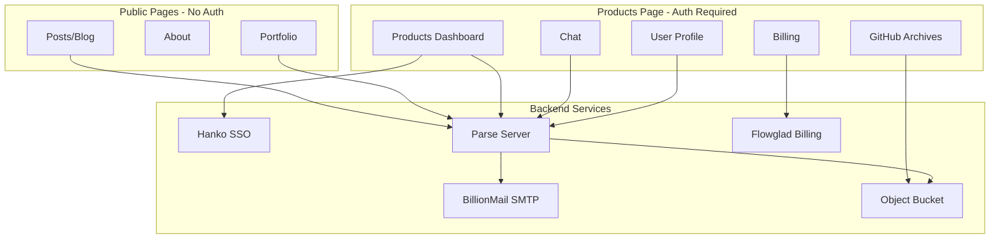
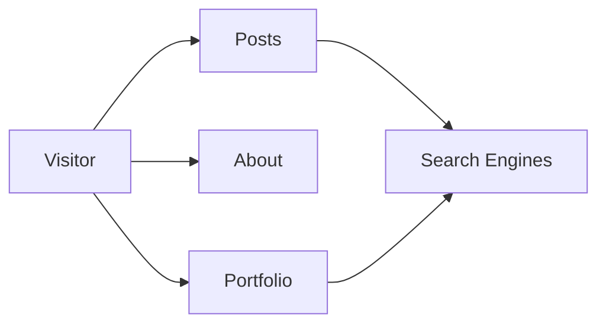
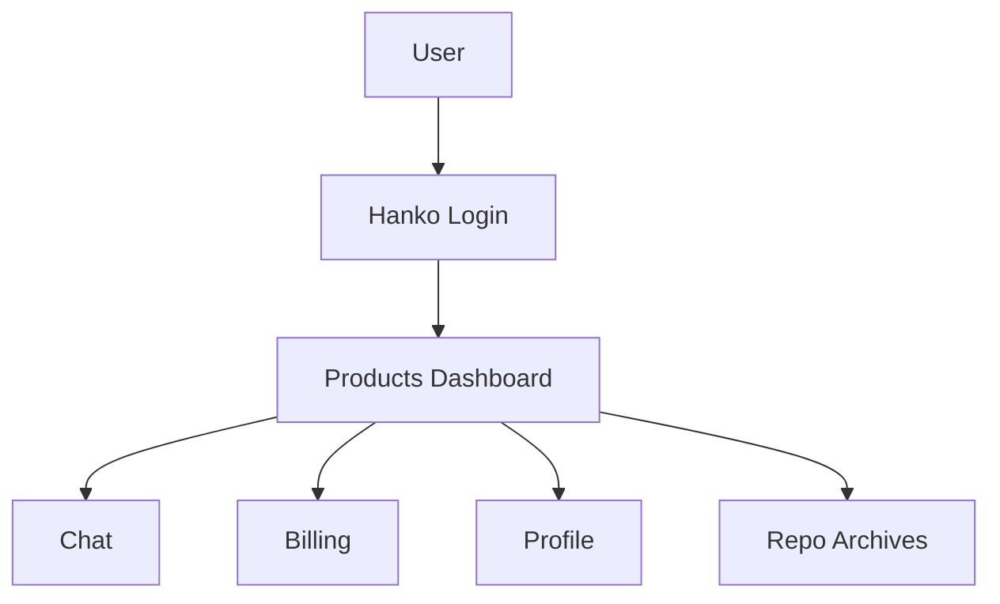
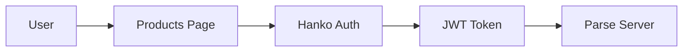
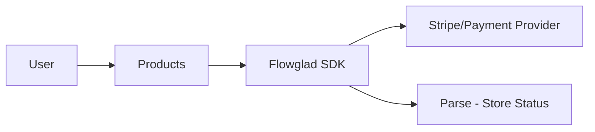
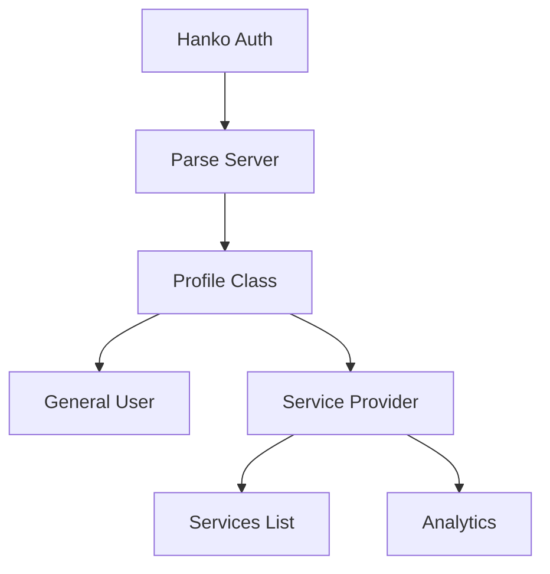
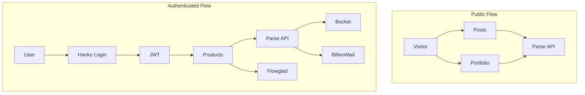
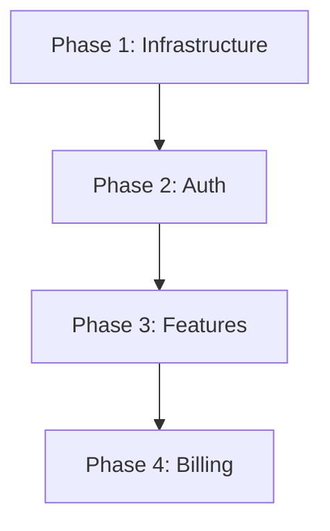
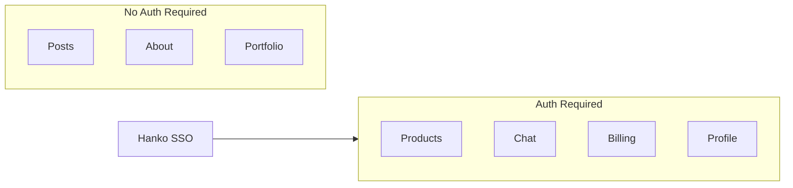

# NewSaaS Platform Expansion Plan

<script src="https://cdn.jsdelivr.net/npm/mermaid@10/dist/mermaid.min.js"></script>
<script>
  mermaid.initialize({ startOnLoad: true, theme: 'default', securityLevel: 'loose' });
</script>

A plan to expand the blog into a full SaaS platform with public marketing pages and a private authenticated Products area.

---

## Architecture Overview



---

## Page Structure

| Page | Access | Purpose |
|------|--------|---------|
| **Posts** | Public | Blog articles, SEO content |
| **About** | Public | Company info, team, mission |
| **Portfolio** | Public | GitHub starred projects showcase |
| **Products** | Authenticated | Dashboard, billing, chat, profile |

---

## 1. Public Frontend (SEO and Attraction)

These pages remain **public** to attract visitors and improve SEO.

### Posts (Blog)
- Articles, tutorials, news
- SEO optimized
- No login required

### About
- Company information
- Team profiles
- Contact info

### Portfolio
- GitHub starred projects (from mystars)
- Categories, search, filters
- Project details and READMEs



---

## 2. Private Products Area (Authenticated)

The **Products page** requires login and contains all premium features.

### Features behind auth:
- User dashboard
- Chat with other users
- Billing and subscriptions
- Profile management
- GitHub repo archives (full downloads)



---

## 3. Backend Services

### 3.1 Parse Server

**Location:** `Backends/parse-server`

**Role:**
- Main API for data storage
- User data linked to Hanko
- Chat messages via LiveQuery
- File references to bucket

### 3.2 Hanko SSO

**Location:** `SSO/hanko`

**Role:**
- Single sign-on for Products page
- Passkeys, passwords, OAuth
- JWT for Parse Server validation

**Auth flow:**



### 3.3 BillionMail SMTP

**Location:** `Mail/BillionMail`

**Role:**
- Welcome emails
- Password reset
- Chat notifications
- Newsletter for subscribers

### 3.4 Flowglad Billing

**Location:** `Payments/flowglad`

**Role:**
- Subscription management
- Usage meters and feature gates
- Stateless billing (no webhooks)

**Integration:**



### 3.5 TestPayment (Development)

**Location:** `Payments/testpayment`

**Role:**
- Mock payment gateway for testing
- Simulates payment flows
- OTP verification
- Webhook simulation

**Use:** Development and testing only, not production.

### 3.6 Object Bucket

**Provider:** MinIO / S3 / R2

**Role:**
- Store full GitHub repo archives
- File storage for user uploads

---

## 4. User Profiles

Two user types in the Products area:

| Type | Capabilities |
|------|--------------|
| **General User** | View products, chat, subscribe |
| **Service Provider** | All above + list services, analytics |



---

## 5. Data Flow



---

## 6. Implementation Phases



### Phase 1: Infrastructure

| Task | Component | Location |
|------|-----------|----------|
| Setup bucket | MinIO/S3/R2 | New |
| Configure Parse | Parse Server | `Backends/parse-server` |
| Deploy BillionMail | Email | `Mail/BillionMail` |

### Phase 2: Authentication

| Task | Component | Location |
|------|-----------|----------|
| Deploy Hanko | SSO | `SSO/hanko` |
| Integrate Hanko with Parse | Auth adapter | Parse config |
| Protect Products page | Frontend | Blog |
| User profile classes | Data model | Parse |

### Phase 3: Features

| Task | Component | Location |
|------|-----------|----------|
| Chat with LiveQuery | Messaging | Parse + Frontend |
| GitHub repo sync to bucket | Pipeline | `mystars` evolution |
| Email notifications | SMTP | BillionMail |

### Phase 4: Billing

| Task | Component | Location |
|------|-----------|----------|
| Integrate Flowglad SDK | Billing | `Payments/flowglad` |
| Setup test environment | Testing | `Payments/testpayment` |
| Subscription plans | Products | Frontend + Flowglad |
| Usage tracking | Metering | Flowglad |

---

## 7. Component Summary

| Component | Location | Purpose |
|-----------|----------|---------|
| **Parse Server** | `Backends/parse-server` | Main API, data, realtime |
| **Hanko** | `SSO/hanko` | Authentication, SSO |
| **BillionMail** | `Mail/BillionMail` | Email delivery |
| **Flowglad** | `Payments/flowglad` | Billing SDK |
| **TestPayment** | `Payments/testpayment` | Payment testing |
| **Object Bucket** | MinIO/S3/R2 | File storage |
| **mystars** | `mystars/` | GitHub repo sync |

---

## 8. Security Model



**Rules:**
- Posts, About, Portfolio = **No authentication**
- Products and all sub-features = **Hanko JWT required**
- Parse API checks JWT for protected endpoints
- Billing operations require valid subscription

---

## 9. Technology Stack

| Layer | Technology |
|-------|------------|
| Frontend | Jekyll (brutalist-blog) |
| Auth | Hanko (passkeys, OAuth) |
| Backend | Parse Server (Node.js) |
| Database | MongoDB |
| Storage | MinIO / S3 / R2 |
| Email | BillionMail (Postfix, Dovecot) |
| Billing | Flowglad (TypeScript SDK) |
| Testing | TestPayment (Python/FastAPI) |

---

## 10. Directory Structure

```
NewSaaS/
├── blog/
│   └── brutalist-blog/      # Jekyll site
│       ├── _posts/          # Blog posts (public)
│       ├── about.md         # About page (public)
│       ├── portfolio.md     # Portfolio (public)
│       └── products.md      # Products (auth required)
├── Backends/
│   └── parse-server/        # Main API
├── SSO/
│   └── hanko/               # Authentication
├── Mail/
│   └── BillionMail/         # Email server
├── Payments/
│   ├── flowglad/            # Billing SDK
│   └── testpayment/         # Mock gateway
├── mystars/                 # GitHub sync
└── infrastructure/
    ├── docker-compose.yml
    └── bucket/              # MinIO config
```

---

## 11. Next Actions

1. **Setup infrastructure** - Bucket, Parse, BillionMail
2. **Deploy Hanko** - Configure OAuth providers
3. **Integrate Hanko with Parse** - JWT validation
4. **Create Products page** - Protected route with auth
5. **Add chat** - Parse LiveQuery + Message class
6. **Integrate Flowglad** - Billing SDK in Products
7. **Test with TestPayment** - Mock payment flows
8. **Sync GitHub repos** - Full archives to bucket

---

*Document version: 2.0 | Last updated: 2026-02-16*
