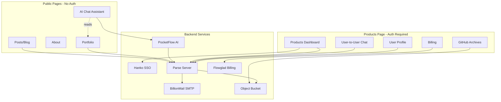
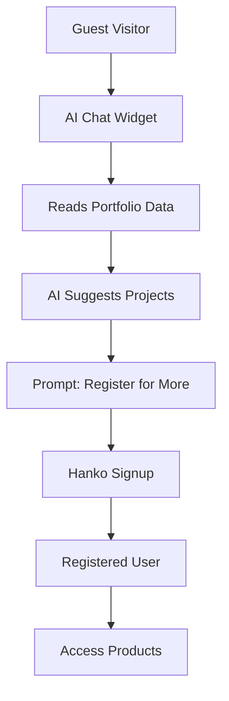
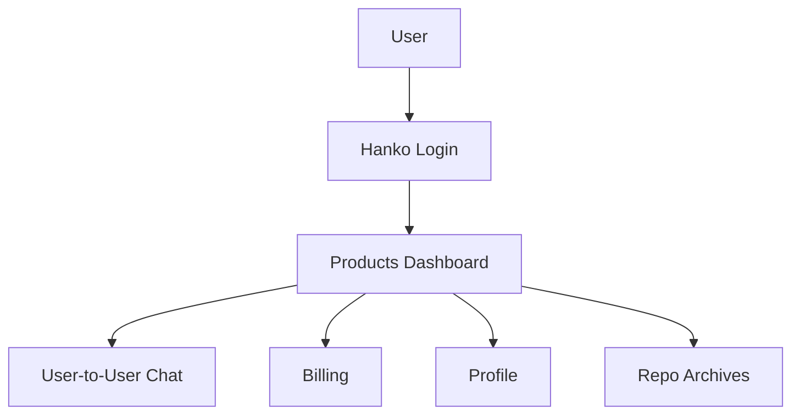
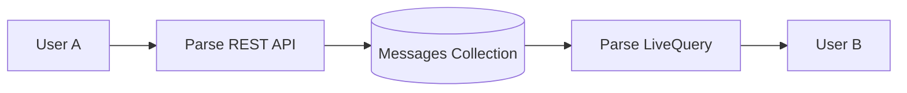
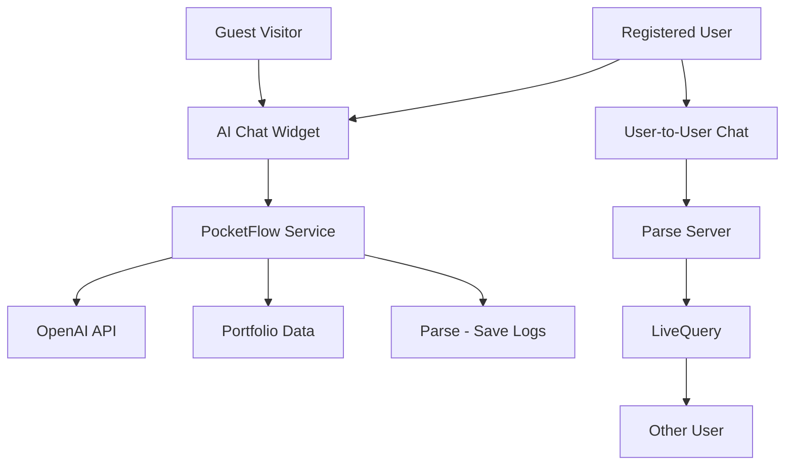
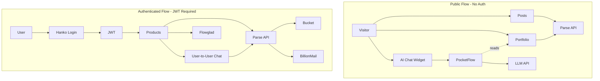
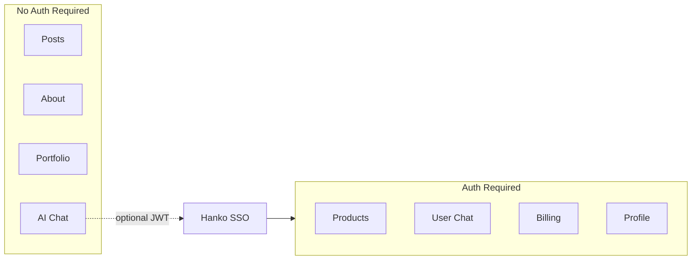

# NewSaaS Platform Expansion Plan

<script src="https://cdn.jsdelivr.net/npm/mermaid@10/dist/mermaid.min.js"></script>
<script>
  mermaid.initialize({ startOnLoad: true, theme: 'default', securityLevel: 'loose' });
</script>

A plan to expand the blog into a full SaaS platform with public marketing pages and a private authenticated Products area.

---

## Architecture Overview



---

## Page Structure

| Page | Access | Purpose |
|------|--------|---------|
| **Posts** | Public | Blog articles, SEO content |
| **About** | Public | Company info, team, mission |
| **Portfolio** | Public | GitHub starred projects showcase |
| **AI Chat** | Public (with guardrails) | AI assistant, reads Portfolio, converts guests to users |
| **Products** | Authenticated | Dashboard, billing, user chat, profile |

---

## 1. Public Frontend (SEO and Attraction)

These pages remain **public** to attract visitors and improve SEO.

### Posts (Blog)
- Articles, tutorials, news
- SEO optimized
- No login required

### About
- Company information
- Team profiles
- Contact info

### Portfolio
- GitHub starred projects (from mystars)
- Categories, search, filters
- Project details and READMEs

### AI Chat Assistant (Public with Guardrails)

The AI chat is **publicly available** to all visitors -- no login required. It serves as a **conversion funnel** to turn guests into registered users.

**How it works for guests:**
- Floating chat widget visible on all public pages
- AI reads through the Portfolio data (projects, categories, READMEs)
- Helps visitors find projects, suggest ideas, answer questions
- After a few exchanges, nudges the guest to register for full features
- Conversation is stored with a session ID (anonymous)

**Guardrail behavior by user state:**

| User State | AI Behavior |
|------------|-------------|
| **Guest (not logged in)** | Can browse Portfolio via AI, limited conversation depth, prompted to register |
| **Registered (logged in)** | Full conversation history, personalized suggestions, no signup prompts |

**Conversion flow:**




---

## 2. Private Products Area (Authenticated)

The **Products page** requires login and contains all premium features.

### Features behind auth:
- User dashboard
- User-to-user chat (real-time messaging via Parse LiveQuery)
- AI Chat with full history (enhanced version, no signup prompts)
- Billing and subscriptions
- Profile management (General User or Service Provider)
- GitHub repo archives (full downloads from bucket)



---

## 3. Backend Services

### 3.1 Parse Server

**Location:** `Backends/parse-server`

**Role:**
- Main API for all app data
- User data linked to Hanko
- User-to-user chat messages via LiveQuery (real-time WebSocket)
- AI chat conversation logs
- File references to bucket
- Cloud Code for business logic

**User-to-User Chat via Parse:**



Parse LiveQuery provides real-time push over WebSocket. When User A sends a message, User B receives it instantly without polling.

**Data Models for Chat:**

```
Message:
  - sender: Pointer<_User>
  - recipient: Pointer<_User>
  - content: String
  - readAt: Date (nullable)
  - createdAt: Date

Conversation:
  - participants: Array<Pointer<_User>>
  - lastMessage: String
  - updatedAt: Date
```

### 3.2 Hanko SSO

**Location:** `SSO/hanko`

**Role:**
- Single sign-on for Products page
- Passkeys, passwords, OAuth (Google, GitHub)
- JWT for Parse Server validation
- AI Chat detects JWT presence to switch between guest and registered behavior

**Auth flow:**


### 3.3 BillionMail SMTP

**Location:** `Mail/BillionMail`

**Role:**
- Welcome emails on signup
- Password reset
- Chat notifications (new message alerts)
- Newsletter for blog subscribers

### 3.4 Flowglad Billing

**Location:** `Payments/flowglad`

**Role:**
- Subscription management
- Usage meters and feature gates
- Stateless billing (no webhooks)

**Integration:**


### 3.5 TestPayment (Development Only)

**Location:** `Payments/testpayment`

**Role:**
- Mock payment gateway for testing
- Simulates payment flows and OTP verification
- Webhook simulation
- Test card: `4444 4444 4444 4444`

**Use:** Development and testing only, never production.

### 3.6 Object Bucket

**Provider:** MinIO / S3 / R2

**Role:**
- Store full GitHub repo archives (tarballs)
- File storage for user uploads
- Chat file attachments (future)

### 3.7 PocketFlow AI Chat (Public Service)

**Location:** `Automation/PocketFlow`

**What is PocketFlow:**
- 100-line minimalist LLM framework
- Zero dependencies, zero vendor lock-in
- Supports Agents, Workflows, RAG, and more
- Python-based with FastAPI integration

**Role:**
- **Public AI assistant** -- available to everyone, no login required
- Reads Portfolio data to help visitors find projects and ideas
- Conversion funnel: guides guests toward registration
- Real-time streaming responses via WebSocket
- Guardrails adjust behavior based on guest vs registered user

**Guardrail Logic:**


| Mode | Conversation Depth | History | Portfolio Access | Signup Prompts |
|------|-------------------|---------|-----------------|----------------|
| **Guest** | Limited (e.g. 10 messages per session) | Session only (anonymous) | Yes (read-only) | Yes, after a few exchanges |
| **Registered** | Unlimited | Persistent (Parse) | Yes + personalized | No |

**Cookbook Examples:**

| Example | Description |
|---------|-------------|
| `pocketflow-chat` | Basic chatbot with history |
| `pocketflow-fastapi-websocket` | Real-time web chat with streaming |
| `pocketflow-chat-memory` | Long-term memory with embeddings |
| `pocketflow-chat-guardrail` | Topic-restricted chatbot |

**Architecture:**


**Key Components:**

1. **FastAPI Server** - WebSocket endpoint at `/ws` (public, no auth required)
2. **GuardrailNode** - Checks JWT presence, sets guest vs registered mode
3. **StreamingChatNode** - AsyncNode for streaming LLM responses
4. **PortfolioReaderNode** - Loads portfolio project data for AI context
5. **AsyncFlow** - Manages conversation flow with mode-aware branching
6. **LLM Integration** - OpenAI GPT-4 or other providers

**Files from Cookbook (`pocketflow-fastapi-websocket`):**

```
pocketflow-fastapi-websocket/
├── main.py          # FastAPI + WebSocket endpoint
├── nodes.py         # StreamingChatNode + GuardrailNode
├── flow.py          # AsyncFlow with branching
├── utils/
│   ├── stream_llm.py    # OpenAI streaming utility
│   └── portfolio.py     # Portfolio data loader
├── static/
│   └── index.html       # Chat widget UI
└── requirements.txt     # Dependencies
```

**Dependencies:**
```
pocketflow
fastapi
uvicorn
openai
```

**Security and Cost Control:**
- `/ws` endpoint is **public** -- no JWT required to connect
- If JWT is present, PocketFlow detects it and switches to registered mode
- Guest sessions: rate limit by IP (e.g. 10 messages/session, 50/day)
- Registered sessions: rate limit by user ID (higher budget)
- All conversations logged in Parse for analytics

---

## 4. Chat: Two Separate Systems

The platform has **two distinct chat systems** with different access levels and purposes.

| Feature | User-to-User Chat | AI Chat Assistant |
|---------|-------------------|-------------------|
| **Access** | Authenticated only (Products) | **Public** (all pages) |
| **Purpose** | Messaging between users | AI help, project discovery, conversion |
| **Backend** | Parse Server + LiveQuery | PocketFlow + FastAPI |
| **Protocol** | Parse LiveQuery (WebSocket) | FastAPI WebSocket |
| **Storage** | Parse Message class | Parse AIConversation class |
| **Real-time** | Yes (LiveQuery push) | Yes (streaming tokens) |
| **Cost** | Free (self-hosted) | Per token (LLM API) |
| **Rate limit** | ACLs (participants only) | IP-based (guest) / user-based (registered) |
| **Portfolio aware** | No | Yes -- reads Portfolio data |



---

## 5. User Profiles

Two user types in the Products area:

| Type | Capabilities |
|------|--------------|
| **Guest (no account)** | AI Chat (limited), browse Portfolio via AI, prompted to register |
| **General User** | AI Chat (full), user-to-user chat, view products, subscribe |
| **Service Provider** | All above + list services, analytics, manage clients |


---

## 6. Data Flow



---

## 7. Implementation Phases


### Phase 1: Infrastructure (Weeks 1-2)

| Task | Component | Location |
|------|-----------|----------|
| Setup object bucket | MinIO/S3/R2 | New |
| Configure Parse Server | Backend API | `Backends/parse-server` |
| Deploy BillionMail | Email server | `Mail/BillionMail` |
| Configure MongoDB | Database | Infrastructure |

### Phase 2: Authentication and Profiles (Weeks 3-4)

| Task | Component | Location |
|------|-----------|----------|
| Deploy Hanko | SSO | `SSO/hanko` |
| Integrate Hanko JWT with Parse | Auth adapter | Parse config |
| Create Profile and ServiceProvider classes | Data model | Parse |
| Protect Products page | Frontend auth | Blog |
| Welcome email on signup | Email | BillionMail |

### Phase 3: AI Chat - Public (Weeks 5-6)

| Task | Component | Location |
|------|-----------|----------|
| Deploy PocketFlow FastAPI service | AI backend | `Automation/PocketFlow` |
| Build portfolio data loader for AI context | AI context | PocketFlow |
| Implement guardrail logic (guest vs registered) | Guardrails | PocketFlow |
| Build floating AI chat widget (all public pages) | Frontend | Blog layout |
| Guest rate limiting by IP | Security | PocketFlow |
| Conversion CTA prompts in guest mode | UX | PocketFlow |

### Phase 4: User-to-User Chat - Authenticated (Weeks 7-8)

| Task | Component | Location |
|------|-----------|----------|
| Create Message and Conversation classes | Data model | Parse |
| Enable Parse LiveQuery | Real-time | Parse config |
| Build user-to-user chat UI | Frontend | Products page |
| Chat notification emails | Email | BillionMail |

### Phase 5: Billing (Weeks 9-10)

| Task | Component | Location |
|------|-----------|----------|
| Integrate Flowglad SDK | Billing | `Payments/flowglad` |
| Setup TestPayment for dev | Testing | `Payments/testpayment` |
| Create subscription plans | Products | Frontend + Flowglad |
| Usage tracking and feature gates | Metering | Flowglad |

### Phase 6: GitHub Archive Pipeline (Weeks 11-12)

| Task | Component | Location |
|------|-----------|----------|
| Repo download service | Pipeline | New service |
| Upload archives to bucket | Storage | Bucket |
| Index repos in Parse | Metadata | Parse |
| Evolve mystars or separate job | Sync | `mystars/` |
| Repo browser in Products page | Frontend | Products page |

---

## 8. Component Summary

| Component | Location | Purpose |
|-----------|----------|---------|
| **Parse Server** | `Backends/parse-server` | Main API, data, user-to-user chat (LiveQuery) |
| **Hanko** | `SSO/hanko` | Authentication, SSO |
| **PocketFlow** | `Automation/PocketFlow` | Public AI chat (guest + registered, with guardrails) |
| **BillionMail** | `Mail/BillionMail` | Email delivery |
| **Flowglad** | `Payments/flowglad` | Billing SDK |
| **TestPayment** | `Payments/testpayment` | Payment testing (dev only) |
| **Object Bucket** | MinIO/S3/R2 | File and repo archive storage |
| **mystars** | `mystars/` | GitHub repo sync |

---

## 9. Security Model



**Rules:**
- Posts, About, Portfolio, AI Chat = **No authentication required**
- Products, User Chat, Billing, Profile = **Hanko JWT required**
- Parse API checks JWT for all protected endpoints
- User-to-user chat ACLs: only participants can read/write messages
- AI Chat (guest): rate limited by IP, limited depth, signup prompts
- AI Chat (registered): JWT detected automatically, full access, saved history
- Billing operations: require valid subscription

---

## 10. Technology Stack

| Layer | Technology | Access |
|-------|------------|--------|
| Frontend | Jekyll (brutalist-blog) | Public |
| AI Chat | PocketFlow (Python/FastAPI) | Public (with guardrails) |
| Auth | Hanko (passkeys, OAuth) | Products gate |
| Backend API | Parse Server (Node.js) | Mixed |
| User Chat | Parse LiveQuery (WebSocket) | Authenticated |
| Database | MongoDB | Backend |
| Storage | MinIO / S3 / R2 | Backend |
| Email | BillionMail (Postfix, Dovecot) | Backend |
| Billing | Flowglad (TypeScript SDK) | Authenticated |
| Testing | TestPayment (Python/FastAPI) | Dev only |

---

## 11. Directory Structure

```
NewSaaS/
├── blog/
│   └── brutalist-blog/      # Jekyll site (frontend)
│       ├── _posts/          # Blog posts (public)
│       ├── about.md         # About page (public)
│       ├── portfolio.md     # Portfolio (public)
│       └── products.md      # Products (auth required)
├── Backends/
│   └── parse-server/        # Main API + user chat
├── SSO/
│   └── hanko/               # Authentication
├── Automation/
│   └── PocketFlow/          # AI chat framework
│       └── cookbook/         # Example implementations
├── Mail/
│   └── BillionMail/         # Email server
├── Payments/
│   ├── flowglad/            # Billing SDK
│   └── testpayment/         # Mock gateway (dev only)
├── mystars/                 # GitHub repo sync
└── infrastructure/
    ├── docker-compose.yml
    └── bucket/              # MinIO config
```

---

## 12. Next Actions

1. **Setup infrastructure** - Bucket, Parse Server, MongoDB, BillionMail
2. **Deploy Hanko** - Configure OAuth providers (Google, GitHub)
3. **Integrate Hanko with Parse** - JWT validation adapter
4. **Create user profile classes** - Profile, ServiceProvider in Parse
5. **Protect Products page** - Hanko Elements login on frontend
6. **Deploy PocketFlow AI Chat** - Public FastAPI WebSocket service
7. **Build AI chat widget** - Floating widget on all public pages
8. **Implement guardrails** - Guest vs registered mode, portfolio reader, conversion CTAs
9. **Build user-to-user chat** - Message class, LiveQuery, chat UI in Products
10. **Chat notification emails** - BillionMail alerts for new messages
11. **Integrate Flowglad** - Billing SDK, subscription plans
12. **Test with TestPayment** - Mock payment flows
13. **Build GitHub archive pipeline** - Download repos to bucket
14. **Index repos in Parse** - Metadata and search

---

*Document version: 4.0 | Last updated: 2026-02-16*
